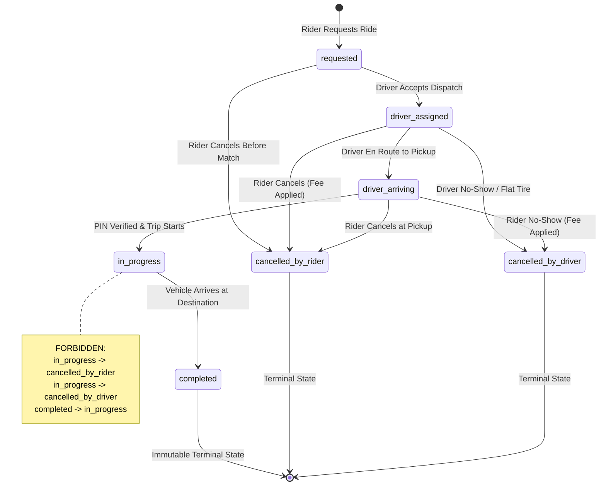

# You Can't Cancel a Moving Car: Why State Machines Belong in Your Database Schema

When backend engineers design data models for ride-hailing or on-demand delivery, the instinctive approach to trip status is embarrassingly naive: add a `status VARCHAR(50)` column, give it values like `requested`, `in_progress`, `completed`, `cancelled`, and let frontend developers post status strings as they please.

Here is the operational disaster that produces: a passenger gets angry at highway traffic while riding at 60 km/h, taps "Cancel Trip", and their phone fires `PATCH /trips/:id { "status": "cancelled" }`. The app says trip cancelled; the driver is left transporting a passenger who no longer has an active trip and cannot be billed; the fare calculation crashes; insurance liability evaporates into thin air.

When designing the data architecture for **ApexRide** (an urban mobility dispatch system), mapping the formal state machine revealed several transitions that seemed plausible in casual conversation but are catastrophic in production.

---

## 1. The State Machine: What Must Be Impossible

Here is the transition graph for a trip lifecycle:



### The Three Forbidden Transitions That Broke My Assumptions:

1. **`in_progress` -> `cancelled_by_rider` (Strictly Forbidden):** Once physical transportation begins, cancellation does not exist. A passenger can request an *early termination*, but that is an expedited transition to `completed` with distance and duration recalculation, triggering payment capture.
2. **`completed` -> Anything (Strictly Forbidden):** A completed trip has an attached `FareReceipt` with money debited from a payment gateway. Re-opening a completed trip invalidates double-entry accounting ledgers.
3. **`requested` -> `in_progress` (Strictly Forbidden):** A trip cannot jump from initial request to in-progress without atomic driver assignment and pickup PIN verification. Skipping intermediate states is the primary signature of GPS spoofing and driver collusion fraud.

---

## 2. Enforcing "One Active Trip Per Rider" with Partial Unique Indexes

How do you guarantee a rider cannot request three rides simultaneously from three browser tabs or parallel API calls?

A regular unique constraint on `("riderId")` fails because a rider should have hundreds of historical completed trips. 

The senior engineering solution is a **PostgreSQL Partial Unique Index**:

```sql
CREATE UNIQUE INDEX "idx_rider_single_active_trip"
ON "Trip"("riderId")
WHERE status IN ('requested', 'driver_assigned', 'driver_arriving', 'in_progress');
```

This index indexes **only rows currently in an active state**. When a rider attempts to create a second active trip, the database engine rejects it immediately with error code `23505 (unique_violation)` before application code can make a mistake.

### Empirical Proof from our Test Suite (`tests/model-proof.test.ts`):
```log
[Constraint 1 Proof] Database rejected duplicate active trip:
Raw query failed. Code: 23505.
Message: Key ("riderId")=(cde53731-2329-4888-bb82-7c624dc375ce) already exists.
```

---

## 3. Deliberate Denormalization: Why Normal Form Destroys History

In textbooks, you are told to normalize: a driver's name lives in `Driver`, vehicle plate lives in `Vehicle`.

In reality, if you normalize historical trips, you create a legal and financial liability. If driver Babatunde Adeleke legally updates his name or swaps his silver Toyota Corolla (plate `KJA-492-AA`) for a black Honda Civic next year, every historical receipt from 2024 retroactively re-renders with the new vehicle plate!

When tax authorities or law enforcement audit a historical trip from two years ago, they require an **immutable audit record** of who drove, what car they drove, and what phone number was used at that exact second.

We snapshot identity attributes directly into `Trip` at the moment of assignment:
```sql
ALTER TABLE "Trip" ADD COLUMN "driverNameSnapshot" VARCHAR(100);
ALTER TABLE "Trip" ADD COLUMN "driverPhoneSnapshot" VARCHAR(20);
ALTER TABLE "Trip" ADD COLUMN "vehiclePlateSnapshot" VARCHAR(20);
```

---

## 4. Query Plan Verification: 0.14ms Execution

By building indexes aligned with the state machine (`idx_trip_rider_completed` on `("riderId", "completedAt" DESC) WHERE status = 'completed'`), querying a rider's trip history with receipts and ratings executes with zero table scans:

```log
EXPLAIN (ANALYZE, BUFFERS)
-> Index Scan using idx_trip_rider_completed on "Trip" t
-> Index Scan using "FareReceipt_tripId_key" on "FareReceipt" f
-> Index Scan using "Review_tripId_key" on "Review" r
Planning Time: 1.253 ms
Execution Time: 0.143 ms
```

---

## Takeaway for System Designers

If your database allows invalid states to exist, your application will eventually write them. Put state machine invariants, partial unique indexes, and non-negative check constraints directly into your PostgreSQL DDL. Your database is not just a dumb bucket of JSON; it is your ultimate integrity coordinator.

*Built for the Product Engineering Bootcamp (Task 3: API Design and Data Modeling).*
