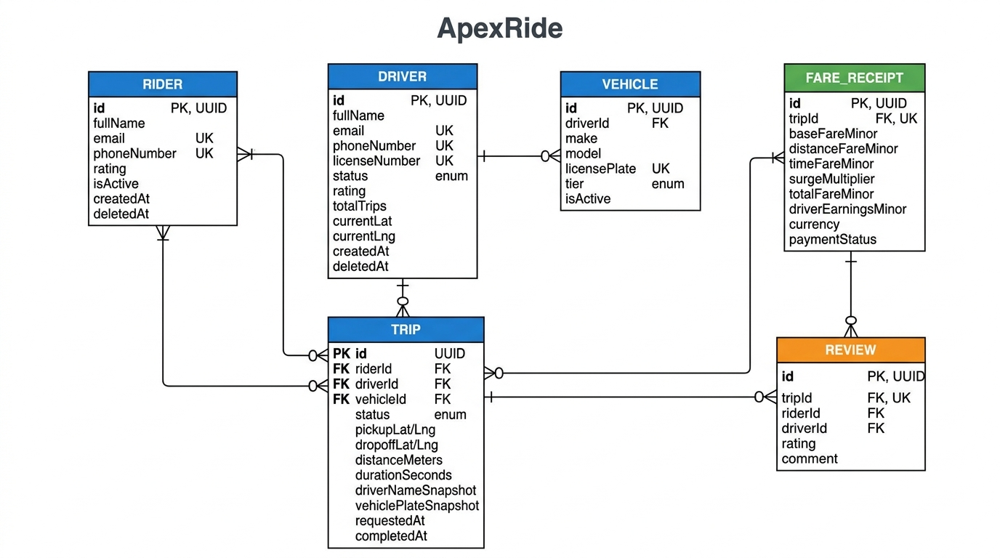
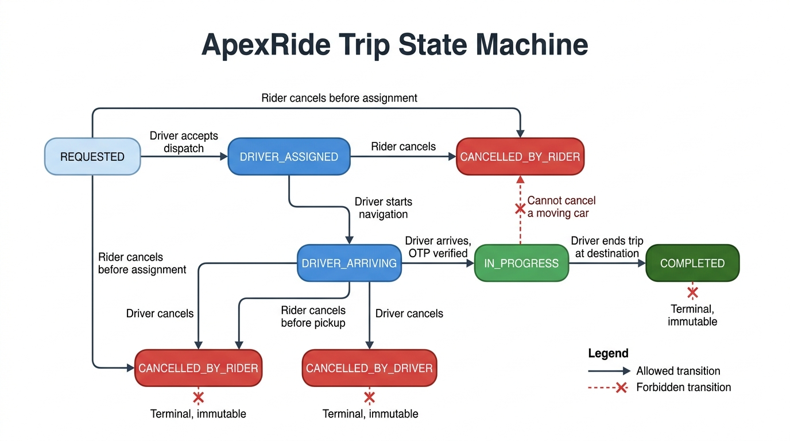

# ApexRide: API Design & High-Scale Data Modeling

A complete architecture, data model, and API design specification for **ApexRide** — a high-concurrency urban ride-hailing and dispatch platform.

---

## Architecture Artifacts & Documentation Index

| Artifact | Purpose & Core Content |
|---|---|
| [`REQUIREMENTS.md`](REQUIREMENTS.md) | Product definition, user personas (Riders, Drivers, Dispatch Operators), and five core user actions. |
| [`ENTITIES.md`](ENTITIES.md) | Full entity specifications, field types, nullability, cardinalities, and Mermaid ER diagram. |
| [`HARD_QUESTIONS.md`](HARD_QUESTIONS.md) | In-depth analysis of the 7 hard questions: deliberate denormalization, integer minor units, state machines, soft deletes, UUIDs, constraints, and query indexes. |
| [`API_CONTRACTS.md`](API_CONTRACTS.md) | Auth model, error envelope, the five action contracts, the shared list contract (pagination/filter/sort), REST vs. GraphQL over-fetching, and WebSockets vs. SSE telemetry. |
| [`POST.md`](POST.md) | Senior engineering publication on state machine integrity and unexpected forbidden transitions. |
| [`evidence/`](evidence/) | Machine-generated proof: DDL catalog inventory, verbatim query plans, verbatim constraint rejections. See [`evidence/README.md`](evidence/README.md). |

---

## Visual Evidence

### Entity-Relationship (ER) Diagram



### Trip State Machine Diagram



---

## The Seven Hard Architectural Decisions Summary

1. **Deliberate Denormalization:** 
   - Immutable snapshot of driver name, phone, and vehicle plate on `Trip` prevents retrospective data corruption when drivers update account profiles or swap vehicles.
   - Aggregate rolling rating and trip counts stored directly on `Driver` eliminates 50+ table scans during spatial dispatch queries.
2. **Integer Minor Units:** All monetary values stored as integers in kobo/cents with companion ISO 4217 `currency` column (`baseFareMinor`, `totalFareMinor`, `driverEarningsMinor`). Floating-point arithmetic strictly banned.
3. **State Machine Invariants:** Strict transition graph preventing impossible transitions (e.g., rider cannot cancel an `in_progress` trip at 60 km/h; completed trips are strictly terminal).
4. **Soft-Delete Compliance:** `Rider` and `Driver` support soft deletion (`deletedAt`) to satisfy GDPR/NDPR Right to be Forgotten while preserving financial transaction and tax audit trails on immutable append-only `Trip` and `FareReceipt` tables.
5. **UUID Identifiers:** Eliminates sequential enumeration scraping attacks and distributed ID coordination bottlenecks.
6. **Database Storage Constraints:** Partial unique indexes (`idx_rider_single_active_trip`, `idx_driver_single_active_trip`, `idx_driver_single_active_vehicle`), CHECK constraints (`check_fare_non_negative`, `check_fare_ledger_balances`, `check_rating_1_to_5`, `check_trip_driver_required_when_assigned`), UNIQUE constraints (`FareReceipt_tripId_key`, `Review_tripId_key`), and one trigger (`trg_review_completed_trip_only`) enforce invariants at the storage layer.
7. **Targeted Indexes:** Composite and partial indexes (`idx_driver_status_geo`, `idx_trip_rider_completed`, `idx_trip_rider_status`, `idx_trip_driver_status`, `idx_trip_status_requestedAt`, `idx_vehicle_driver`, `idx_review_driver_rating`, `idx_review_rider`) are shaped for the ten hot query patterns. **On the 5-row seed the planner correctly still chooses `Seq Scan` for every one of them** — see the honest result below.

---

## Empirical Verification & Query Execution Plans

Every claim in this section is reproducible with the commands shown, and every artifact under [`evidence/`](evidence/) is machine-generated from the live database. Nothing here is transcribed by hand.

### Prerequisites

```bash
npm install
npm run migrate     # idempotent; applies DDL and writes evidence/ddl-inventory.txt
npm run seed        # 5 rows per table
npm test            # 11 tests; writes evidence/constraint-violations.txt
npm run explain     # writes evidence/query-plans.txt
```

`npx prisma validate --schema prisma/schema.prisma` and `npx prisma migrate status --schema prisma/schema.prisma` confirm the Prisma view and migration history line up.

### 1. Verification Test Suite (`npm test`) — 11/11 passing

The suite runs against the deployed PostgreSQL, not a local substitute. It creates its own fixtures in `beforeAll` and removes them in `afterAll`, so the seeded dataset is left exactly as found.

| Test | What it proves |
|---|---|
| Action 1: Rider requests a trip | Row is created unassigned; the active-trip guard returns exactly it |
| Action 2: Driver accepts a dispatch offer | Geofence search returns only available drivers inside 3 km, nearest first |
| Action 3: Driver arrives & begins trip | The guarded transition fires once and is replay-safe |
| Action 4: Driver completes trip & bills | Every receipt reconciles against the minor-unit ledger identities |
| Action 5: Rider submits a review | Only completed, un-reviewed trips are eligible; stored reviews point at completed trips |
| List contract | `limit`/`offset` paging is stable, ordered, and disjoint across pages |
| Constraint Proof 1 | Second concurrent active trip for a rider **and** for a driver → `23505` |
| Constraint Proof 2 | Ratings `6`, `0`, `-1` rejected → `23514`; boundaries `1` and `5` accepted |
| Constraint Proof 3 | Negative `totalFareMinor` and negative `driverEarningsMinor` rejected → `23514` |
| Constraint Proof 4 | A review of each of the **six** non-completed statuses rejected → `23514` |
| Constraint Proof 5 | A second **active** vehicle per driver rejected → `23505`; a retired one still allowed |

Verbatim server messages for every rejection: [`evidence/constraint-violations.txt`](evidence/constraint-violations.txt).

**On the three partial-unique proofs:** PostgreSQL never prints a partial index's name in a `23505` — it reports only the conflicting key columns. So those proofs assert the SQLSTATE and the conflicting column, then prove the index identity the only way that is actually provable: **the same insert succeeds once the row's status leaves the partial predicate.** A blanket `UNIQUE` would have failed that control.

### 2. Execution Plans (`npm run explain`) — the honest result

`evidence/query-plans.txt` holds 11 verbatim `EXPLAIN (ANALYZE, BUFFERS)` plans plus the live 28-index inventory.

```
ROW COUNTS AT CAPTURE TIME
  Rider 5   Driver 5   Vehicle 5   Trip 5   FareReceipt 5   Review 5
```

**All 11 plans chose `Seq Scan`.** That is the correct decision, not a missing index: scanning a 5-row heap that fits in one shared buffer beats any index probe. An earlier version of this README claimed `Index Scan using idx_driver_status_geo` at "0.249 ms" — that line was not reproducible and has been removed rather than restated.

To show the indexes are nonetheless correctly shaped, the same 11 queries are captured with `enable_seqscan = off` inside a transaction-local setting. Those are labelled **DIAGNOSTIC** plans, and the file reports which index each one actually reached — including cases where the planner picked a *different* index than the documentation names, rather than editing the output to match.

The defensible claim: the indexes exist and match the query shapes; at production row counts the planner will use them; on a 5-row seed it correctly does not.
