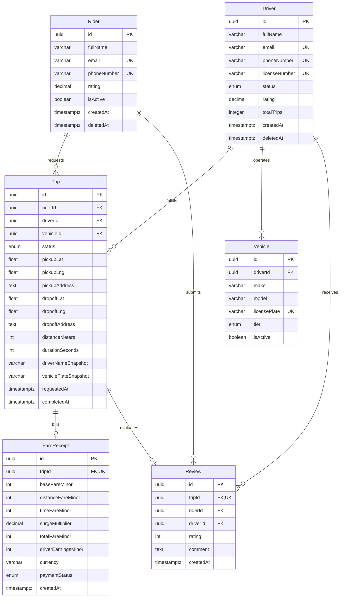

# ApexRide: Entity Models & Cardinality Specifications

## 1. Entity Definitions & Field Specifications

### 1.1 `Rider`
*A registered user who requests, rides, and pays for transportation.*
- `id`: `UUID` (Primary Key, generated v4/v7)
- `fullName`: `VARCHAR(100)` (Required)
- `email`: `VARCHAR(255)` (Required, Unique)
- `phoneNumber`: `VARCHAR(20)` (Required, Unique, E.164 standard)
- `rating`: `DECIMAL(3, 2)` (Default `5.00`, calculated aggregate)
- `isActive`: `BOOLEAN` (Default `true`)
- `createdAt`: `TIMESTAMPTZ` (Required, default `NOW()`)
- `updatedAt`: `TIMESTAMPTZ` (Required)
- `deletedAt`: `TIMESTAMPTZ` (Nullable, for soft-delete compliance)

### 1.2 `Driver`
*A licensed commercial operator certified to accept rides and transport passengers.*
- `id`: `UUID` (Primary Key, generated v4/v7)
- `fullName`: `VARCHAR(100)` (Required)
- `email`: `VARCHAR(255)` (Required, Unique)
- `phoneNumber`: `VARCHAR(20)` (Required, Unique, E.164)
- `licenseNumber`: `VARCHAR(50)` (Required, Unique)
- `status`: `ENUM('offline', 'available', 'busy', 'suspended')` (Default `offline`)
- `rating`: `DECIMAL(3, 2)` (Default `5.00`, calculated aggregate)
- `totalTrips`: `INTEGER` (Default `0`)
- `currentLat`: `DOUBLE PRECISION` (Nullable, latest telemetry ping)
- `currentLng`: `DOUBLE PRECISION` (Nullable, latest telemetry ping)
- `createdAt`: `TIMESTAMPTZ` (Required, default `NOW()`)
- `updatedAt`: `TIMESTAMPTZ` (Required)
- `deletedAt`: `TIMESTAMPTZ` (Nullable)

### 1.3 `Vehicle`
*A registered motor vehicle assigned to a driver for commercial service.*
- `id`: `UUID` (Primary Key)
- `driverId`: `UUID` (Foreign Key -> `Driver.id`, Unique per active vehicle)
- `make`: `VARCHAR(50)` (Required, e.g. "Toyota")
- `model`: `VARCHAR(50)` (Required, e.g. "Corolla")
- `year`: `INTEGER` (Required, e.g. 2021)
- `licensePlate`: `VARCHAR(20)` (Required, Unique)
- `tier`: `ENUM('standard', 'comfort', 'xl')` (Default `standard`)
- `color`: `VARCHAR(30)` (Required)
- `isActive`: `BOOLEAN` (Default `true`)
- `createdAt`: `TIMESTAMPTZ` (Required)
- `updatedAt`: `TIMESTAMPTZ` (Required)

### 1.4 `Trip`
*The core transactional entity representing a point-to-point ride.*
- `id`: `UUID` (Primary Key)
- `riderId`: `UUID` (Foreign Key -> `Rider.id`, Required)
- `driverId`: `UUID` (Foreign Key -> `Driver.id`, Nullable until accepted)
- `vehicleId`: `UUID` (Foreign Key -> `Vehicle.id`, Nullable until accepted)
- `status`: `ENUM('requested', 'driver_assigned', 'driver_arriving', 'in_progress', 'completed', 'cancelled_by_rider', 'cancelled_by_driver')` (Default `requested`)
- `pickupLat`: `DOUBLE PRECISION` (Required)
- `pickupLng`: `DOUBLE PRECISION` (Required)
- `pickupAddress`: `TEXT` (Required)
- `dropoffLat`: `DOUBLE PRECISION` (Required)
- `dropoffLng`: `DOUBLE PRECISION` (Required)
- `dropoffAddress`: `TEXT` (Required)
- `distanceMeters`: `INTEGER` (Actual recorded odometer distance)
- `durationSeconds`: `INTEGER` (Actual recorded elapsed ride time)
- `driverNameSnapshot`: `VARCHAR(100)` (Deliberate denormalization)
- `driverPhoneSnapshot`: `VARCHAR(20)` (Deliberate denormalization)
- `vehiclePlateSnapshot`: `VARCHAR(20)` (Deliberate denormalization)
- `vehicleModelSnapshot`: `VARCHAR(100)` (Deliberate denormalization)
- `requestedAt`: `TIMESTAMPTZ` (Required, default `NOW()`)
- `acceptedAt`: `TIMESTAMPTZ` (Nullable)
- `startedAt`: `TIMESTAMPTZ` (Nullable)
- `completedAt`: `TIMESTAMPTZ` (Nullable)
- `cancelledAt`: `TIMESTAMPTZ` (Nullable)
- `cancellationReason`: `TEXT` (Nullable)
- `createdAt`: `TIMESTAMPTZ` (Required)
- `updatedAt`: `TIMESTAMPTZ` (Required)

### 1.5 `FareReceipt`
*An immutable billing record capturing the financial ledger breakdown of a completed trip.*
- `id`: `UUID` (Primary Key)
- `tripId`: `UUID` (Foreign Key -> `Trip.id`, Unique 1-to-1)
- `baseFareMinor`: `INTEGER` (Required, base flag-drop fee in kobo/cents)
- `distanceFareMinor`: `INTEGER` (Required, distance component in kobo/cents)
- `timeFareMinor`: `INTEGER` (Required, duration component in kobo/cents)
- `surgeMultiplier`: `DECIMAL(3, 2)` (Default `1.00`, dynamic demand surge factor)
- `subtotalMinor`: `INTEGER` (Required, computed before taxes/promotions)
- `discountMinor`: `INTEGER` (Default `0`)
- `totalFareMinor`: `INTEGER` (Required, final billed amount to rider)
- `platformFeeMinor`: `INTEGER` (Required, marketplace commission ~20%)
- `driverEarningsMinor`: `INTEGER` (Required, payout credited to driver)
- `currency`: `VARCHAR(3)` (Default `'NGN'`, ISO 4217 standard)
- `paymentStatus`: `ENUM('pending', 'succeeded', 'failed', 'refunded')` (Default `pending`)
- `paymentMethod`: `VARCHAR(50)` (e.g. "card", "wallet", "cash")
- `paymentReference`: `VARCHAR(100)` (External PSP reference ID)
- `createdAt`: `TIMESTAMPTZ` (Required, default `NOW()`)

### 1.6 `Review`
*A post-trip performance assessment submitted by the rider for a completed trip.*
- `id`: `UUID` (Primary Key)
- `tripId`: `UUID` (Foreign Key -> `Trip.id`, Unique 1-to-1)
- `riderId`: `UUID` (Foreign Key -> `Rider.id`, Required)
- `driverId`: `UUID` (Foreign Key -> `Driver.id`, Required)
- `rating`: `INTEGER` (Required, Check constraint: `rating BETWEEN 1 AND 5`)
- `comment`: `TEXT` (Nullable, user feedback text)
- `createdAt`: `TIMESTAMPTZ` (Required, default `NOW()`)

---

## 2. Cardinality Matrix

| Parent Entity | Relationship | Child Entity | Cardinality | Explanation |
|---|---|---|---|---|
| `Driver` | assigns | `Vehicle` | 1-to-1 (active) / 1-to-N (historical) | A driver currently operates exactly one active vehicle; may transition across multiple vehicles over time. |
| `Rider` | requests | `Trip` | 1-to-N | A rider creates multiple trips across their account lifetime, but database constraint permits at most 1 active trip at any moment. |
| `Driver` | fulfills | `Trip` | 1-to-N | A driver fulfills hundreds of historical trips, but at most 1 active trip concurrently. |
| `Trip` | generates | `FareReceipt` | 1-to-1 | A trip generates exactly one financial receipt upon completion. |
| `Trip` | receives | `Review` | 0-to-1 | A completed trip may receive at most one review from the rider. |
| `Rider` | authors | `Review` | 1-to-N | A rider authors one review per completed trip. |
| `Driver` | receives | `Review` | 1-to-N | A driver accumulates multiple reviews over their service tenure. |

---

## 3. Entity-Relationship (ER) Diagram

